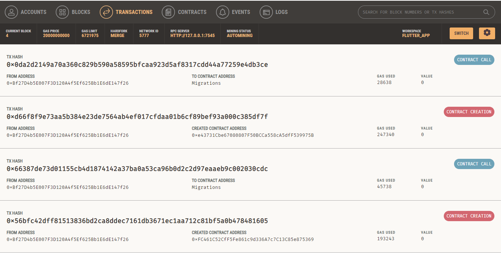
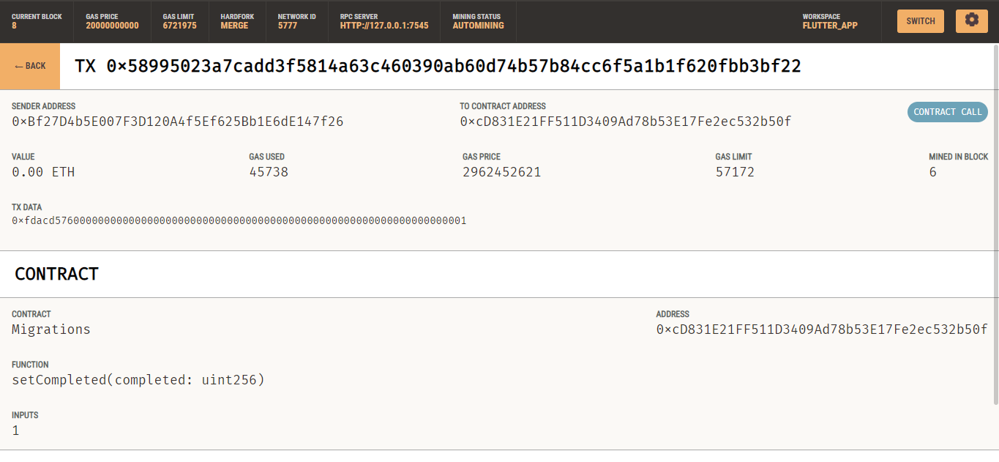
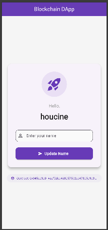
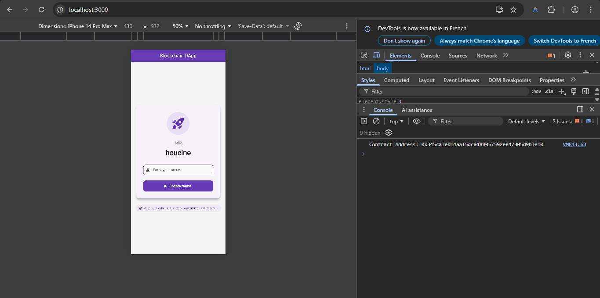

# Flutter DApp: Hello World on Blockchain

A decentralized application (DApp) demonstrating a full-stack integration between **Flutter** and **Ethereum** (via Ganache & Truffle). This project allows users to read and write a string ("name") to a smart contract deployed on a local blockchain.






## 🌟 Features
- **Smart Contract**: Solidity contract [`HelloWorld.sol`](contracts/HelloWorld.sol) to store and retrieve a name.
- **Flutter Framework**: Cross-platform UI (Mobile/Web/Desktop) to interact with the blockchain.
- **Web3 Integration**: Uses `web3dart` to communicate with the Ethereum network (RPC/WebSocket).
- **Real-time Updates**: Updates the UI when transactions are mined.

## 🛠 Prerequisites
Ensure you have the following installed:
- **Node.js** & **npm**
- **Truffle**: `npm install -g truffle`
- **Ganache**: GUI or CLI (for local blockchain)
- **Flutter SDK**

## 🚀 Setup Guide

### 1. Configure Ganache
1. Open **Ganache**.
2. Create a **New Workspace**.
3. **Add Project**: Select `truffle-config.js` from this project's root.
4. **Server Settings**:
   - Port Number: `7545`
   - Network ID: `5777` (or default)
5. **Accounts & Keys** (CRITICAL):
   - Toggle **Autogenerate HD Mnemonic** to **OFF**.
   - Paste this specific Mnemonic:
     ```text
     candy maple cake sugar pudding cream honey rich smooth crumble sweet treat
     ```
   *(This ensures the private keys used in the Flutter app match your local blockchain).*

### 2. Deploy Smart Contracts
Open a terminal in the project root:

```bash
# Install Truffle dependencies (if any)
npm install

# Compile and Deploy contracts to Ganache
truffle migrate --reset
```

### 3. Sync Artifacts
After deploying, we need to copy the contract ABI to the Flutter app so it knows how to interact with the contract.

**Windows Command:**
```powershell
copy build\contracts\HelloWorld.json migrations\flutter_application_1\src\artifacts\HelloWorld.json
```

### 4. Run the Flutter App
Navigate to the Flutter directory and run the app.

```bash
cd migrations/flutter_application_1

# Run on Chrome (Recommended for quick testing)
flutter run -d chrome --web-port=3000
```
*Note: We use port 3000 to keep it consistent.*

## 📂 Project Structure

```
├── contracts/                  # Solidity Smart Contracts
│   └── HelloWorld.sol          # Main logic contract
├── migrations/                 # Truffle deployment scripts
│   └── flutter_application_1/  # The Flutter Application
│       ├── lib/
│       │   ├── main.dart       # Entry point
│       │   ├── helloUI.dart    # User Interface
│       │   └── contract_linking.dart # Web3 Logic
│       └── src/artifacts/      # Contract JSON/ABI
├── test/                       # Smart Contract Tests
└── truffle-config.js           # Truffle Configuration
```

## 📱 How to Use
1. The app will launch showing **"Hello, Unknown"** (default state).
2. Enter a name (e.g., "DeepMind") in the text field.
3. Click **Set Name**.
4. Approve the transaction (handled automatically by the app using the hardcoded private key).
5. Watch the simulations logs or Ganache blocks increment.
6. The text updates to **"Hello, DeepMind"**.

---
*Built for educational purposes to demonstrate Blockchain x Flutter integration.*
